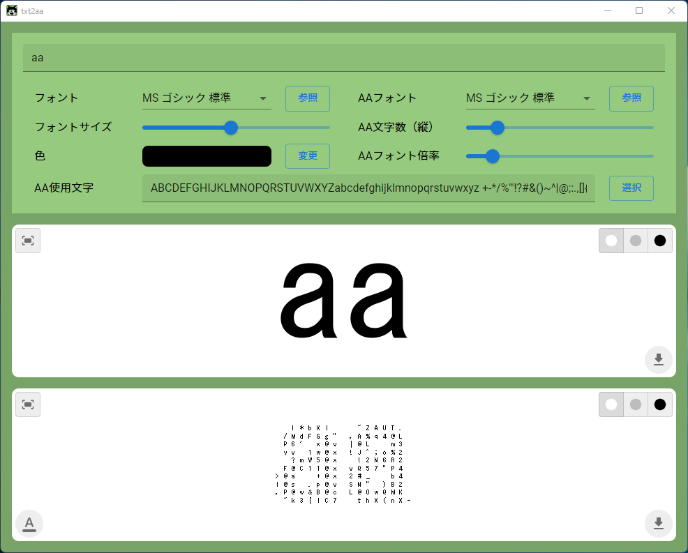

# txt2aa

入力テキストからアスキーアートを生成する。




## Requirement

- Windows 10 or 11
- Python 3.8
- pipenv
- Node.js 16
- yarn


## Build

at `.\front\`

```powershell
> yarn install
```

at `.\`

```powershell
> pipenv sync
> .\bat\build.bat
```
