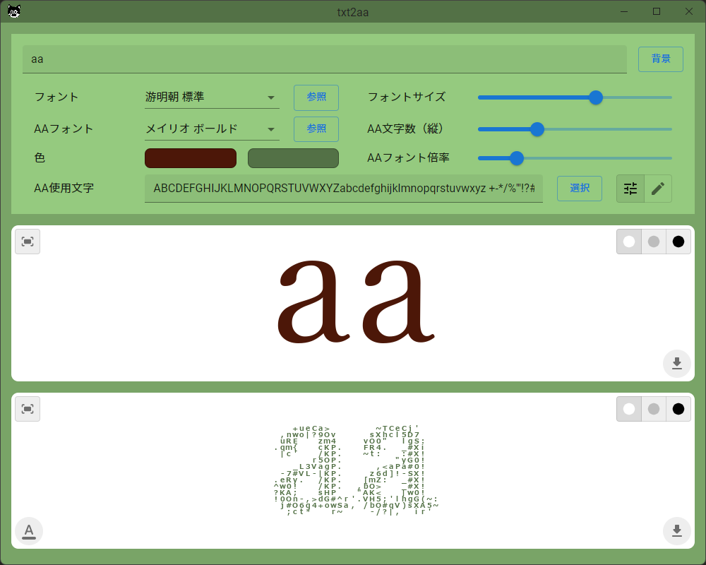

# txt2aa

入力テキストからアスキーアートを生成する。




<<<<<<< HEAD
## Requirement

- Windows 10 or 11
- Python 3.8
- pipenv
- Node.js 16
- yarn
=======
## Requirements

- Windows 10 or 11
- Node.js 16
- yarn
- Python 3.8
- pipenv
>>>>>>> electron


## Build

<<<<<<< HEAD
at `.\front\`

```powershell
> yarn install
=======
at `.\py\`

```powershell
> pipenv sync
>>>>>>> electron
```

at `.\`

```powershell
<<<<<<< HEAD
> pipenv sync
> .\bat\build.bat
=======
> yarn install
> .\scripts\build.bat
>>>>>>> electron
```
